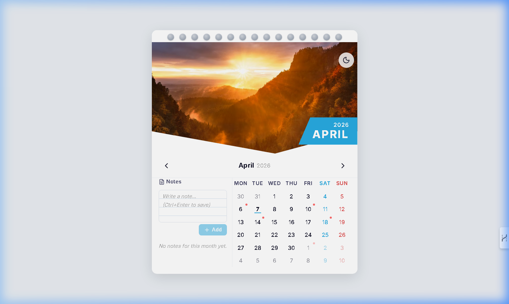

<div align="center">

# 🗓 Wall Calendar

### A Production-Grade Interactive Calendar Experience

*Inspired by physical wall calendars — spiral binding, full-bleed hero imagery, and clean grid layouts — fully reimagined as an interactive digital experience.*

<br />

[](https://swe-task-ecdgwl5yq-joylan9s-projects.vercel.app)

<br />


<br />



<br />

</div>

---

## 📑 Table of Contents

- [✨ Features](#-features)
- [🛠 Tech Stack](#-tech-stack)
- [🏗 Architecture](#-architecture)
- [📁 Project Structure](#-project-structure)
- [🚀 Getting Started](#-getting-started)
- [🧪 Testing](#-testing)
- [🎨 Design Decisions](#-design-decisions)
- [♿ Accessibility](#-accessibility)
- [📱 Responsive Design](#-responsive-design)
- [🔮 Roadmap](#-roadmap)
- [📄 License](#-license)

---

## ✨ Features

<table>
<tr>
<td width="50%">

### 📅 Core Calendar
- **Wall Calendar Aesthetic** — Decorative spiral binding, full-bleed hero images with diagonal chevron `clip-path`, Month+Year badge on a blue geometric polygon
- **Date Grid** — ISO week standard (Monday start), SAT/SUN weekend accents, overflow date rendering, today highlighting
- **Month Navigation** — Animated page-flip transitions via Framer Motion with hero image changes per month
- **Keyboard Navigation** — Full arrow-key traversal across the date grid

</td>
<td width="50%">

### 🎯 Date Range Selection
- **Three-click state machine** — Click 1 sets start, Click 2 sets end (auto-swaps if before start), Click 3 resets
- **Visual states** — `idle` · `range-start` (left pill) · `range-end` (right pill) · `range-middle` (fill) · `single-day` (circle)
- **Hover preview** — Ghost/preview range shown while hovering after start selection
- **Touch support** — Same selection logic works seamlessly on touch devices

</td>
</tr>
<tr>
<td width="50%">

### 📝 Notes System
- **Range-tagged notes** — Notes attached to selected date ranges or general monthly notes
- **Ruled lines** — CSS `repeating-linear-gradient` simulates notebook paper
- **CRUD operations** — Add, view, and delete notes
- **localStorage persistence** — All notes auto-saved under `wall-calendar-notes` key

</td>
<td width="50%">

### 🎨 Theming & Extras
- **Light & Dark modes** — Full theme switching with CSS custom properties + smooth transitions
- **Persistent preference** — Theme saved to localStorage
- **🇮🇳 Holiday Markers** — Indian public holidays (Republic Day, Independence Day, Diwali, etc.)
- **🖨 Print Stylesheet** — Clean, ink-friendly `@media print` CSS

</td>
</tr>
</table>

---

## 🛠 Tech Stack

| Layer | Technology | Version | Purpose |
|:-----:|-----------|---------|---------|
| ⚛️ | **React** | `19.2` | UI framework — functional components + hooks |
| 🔷 | **TypeScript** | `6.0` | Static type safety (strict mode enabled) |
| 🎨 | **Tailwind CSS** | `4.2` | Utility-first styling for layout & spacing |
| 📅 | **date-fns** | `4.1` | Pure, tree-shakeable date manipulation |
| 🎬 | **Framer Motion** | `12.x` | Page-flip animations & smooth transitions |
| 🎯 | **lucide-react** | `1.7` | Icon system (ChevronLeft/Right, Sun/Moon, Trash2) |
| ⚡ | **Vite** | `8.0` | Build tool & lightning-fast dev server |
| 🧪 | **Vitest** | `4.1` | Unit & component testing |
| 🧩 | **React Testing Library** | `16.x` | User-centric component testing |

---

## 🏗 Architecture

```
┌─────────────────────────────────────────────────────────────┐
│                      🚪 ENTRY POINT                         │
│  main.tsx ──▶ App.tsx                                       │
└────────────────────────┬────────────────────────────────────┘
                         │
                         ▼
┌─────────────────────────────────────────────────────────────┐
│               📅 WallCalendar.tsx (Orchestrator)            │
│                                                             │
│  ┌──────────────────┐  ┌──────────────────┐                 │
│  │ CalendarHeader    │  │ ThemeToggle      │                 │
│  │ (Spiral + Hero    │  │ (Light/Dark)     │                 │
│  │  + Month Badge)   │  └──────────────────┘                 │
│  └──────────────────┘                                       │
│                                                             │
│  ┌──────────────────┐  ┌──────────────────┐                 │
│  │ MonthNavigator   │  │ CalendarGrid     │                 │
│  │ (Prev/Next)      │  │ (7-column grid)  │                 │
│  └──────────────────┘  │                  │                 │
│                        │  ┌─────────────┐ │                 │
│  ┌──────────────────┐  │  │ CalendarDay │ │                 │
│  │ NotesPanel       │  │  │ (React.memo)│ │                 │
│  │ (Textarea+List)  │  │  └─────────────┘ │                 │
│  └──────────────────┘  └──────────────────┘                 │
└─────────────────────────────────────────────────────────────┘
                         │
          ┌──────────────┼──────────────┐
          ▼              ▼              ▼
┌──────────────┐ ┌──────────────┐ ┌──────────────┐
│ 🪝 Hooks     │ │ 🔧 Utils     │ │ 📦 Data      │
│              │ │              │ │              │
│ useCalendar  │ │ calendarUtils│ │ constants.ts │
│ (useReducer) │ │ (date-fns)   │ │ (images,     │
│              │ │              │ │  holidays,   │
│ useDateRange │ │ imageUtils   │ │  colors)     │
│ (hover)      │ │ (month→img)  │ │              │
│              │ │              │ │ types.ts     │
│ useNotes     │ │              │ │ (interfaces) │
│ (CRUD+store) │ │              │ │              │
└──────────────┘ └──────────────┘ └──────────────┘
```

### State Management Flow

```
  ┌─────────┐
  │  IDLE   │◀────────────────────────────────────┐
  └────┬────┘                                     │
       │ Click date                               │
       ▼                                          │
  ┌──────────────┐                                │
  │ START        │──── Hover ──▶ Ghost Preview     │
  │ SELECTED     │                                │
  └────┬─────────┘                                │
       │                                          │
       ├── Click same date ──▶ SINGLE DAY ────────┤
       │                                          │
       └── Click diff date ──▶ RANGE COMPLETE ────┘
                               (auto-swap if
                                end < start)
```

---

## 📁 Project Structure

```
📦 SWE_Intern_task/
├── 📄 index.html                          # HTML entry + meta + fonts
├── 📄 vite.config.ts                      # Vite + React plugin config
├── 📄 tsconfig.json                       # TypeScript project refs
├── 📄 package.json                        # Scripts & dependencies
│
├── 📂 public/
│   ├── favicon.svg                        # App favicon
│   └── icons.svg                          # SVG sprite sheet
│
└── 📂 src/
    ├── 📄 main.tsx                        # React DOM mount
    ├── 📄 App.tsx                         # Application shell
    ├── 📄 index.css                       # Design tokens + global styles
    │
    ├── 📂 components/
    │   └── 📂 WallCalendar/
    │       ├── 📄 index.tsx               # Public barrel export
    │       ├── 📄 WallCalendar.tsx        # Root orchestrator component
    │       ├── 📄 WallCalendar.test.tsx   # 10 test cases (Vitest + RTL)
    │       │
    │       ├── 📄 CalendarHeader.tsx      # Spiral binding + hero + badge
    │       ├── 📄 CalendarGrid.tsx        # 7-column grid + keyboard nav
    │       ├── 📄 CalendarDay.tsx         # Atomic day cell (React.memo)
    │       ├── 📄 MonthNavigator.tsx      # Prev/Next month arrows
    │       ├── 📄 NotesPanel.tsx          # Notes textarea + saved list
    │       ├── 📄 ThemeToggle.tsx         # Light/Dark theme switcher
    │       │
    │       ├── 📂 hooks/
    │       │   ├── useCalendar.ts         # Calendar state (useReducer)
    │       │   ├── useDateRange.ts        # Hover preview range logic
    │       │   └── useNotes.ts            # Notes CRUD + localStorage
    │       │
    │       ├── 📂 utils/
    │       │   ├── calendarUtils.ts       # Pure date helpers (date-fns)
    │       │   └── imageUtils.ts          # Month → image mapping
    │       │
    │       ├── 📂 types/
    │       │   └── calendar.types.ts      # All TypeScript interfaces
    │       │
    │       └── 📂 constants/
    │           └── calendar.constants.ts  # Month images, holidays, colors
    │
    └── 📂 test/
        └── ...                            # Test setup & configuration
```

---

## 🚀 Getting Started

### Prerequisites

- **Node.js** `≥ 18.0` — [Download](https://nodejs.org/)
- **npm** `≥ 9.0` (bundled with Node.js)

### Installation

```bash
# 1 · Clone the repository
git clone https://github.com/Joylan9/SWE_TASK.git

# 2 · Navigate into the project
cd SWE_TASK

# 3 · Install dependencies
npm install

# 4 · Start the development server
npm run dev
```

The app will be available at **[http://localhost:5173](http://localhost:5173)**

### Available Scripts

| Command | Description |
|---------|-------------|
| `npm run dev` | Start Vite dev server with HMR |
| `npm run build` | Type-check + production build |
| `npm run preview` | Preview the production build locally |
| `npm run lint` | Run ESLint across the project |
| `npm run test` | Run all tests once |
| `npm run test:watch` | Run tests in watch mode |
| `npm run test:coverage` | Run tests with coverage report |

---

## 🧪 Testing

The project includes **10 comprehensive test cases** built with Vitest + React Testing Library:

```bash
# Run all tests
npm run test

# Watch mode (re-runs on file changes)
npm run test:watch

# Generate coverage report
npm run test:coverage
```

<details>
<summary><strong>📋 Full Test Suite Breakdown</strong></summary>

<br />

| # | Test Case | What It Validates |
|:-:|-----------|-------------------|
| 1 | **Renders current month/year** | Component initializes with system date |
| 2 | **Date selection as range start** | Clicking a date sets `aria-selected="true"` |
| 3 | **Two-date range creation** | Verifies start → middle → end visual states |
| 4 | **Single-day selection** | Same date clicked twice → `single` state |
| 5 | **Third click resets range** | State machine resets and starts new selection |
| 6 | **Note creation + persistence** | Adds note to DOM list and calls localStorage |
| 7 | **Note deletion** | Removes note from DOM and storage |
| 8 | **Month navigation** | Next month button correctly updates the label |
| 9 | **Range auto-swap** | End < Start → automatically swapped |
| 10 | **ARIA labels validation** | Every day cell has a valid `aria-label` |

</details>

---

## 🎨 Design Decisions

<details open>
<summary><strong>Why <code>useReducer</code> over <code>useState</code>?</strong></summary>

<br />

The calendar manages complex, interdependent state: month, year, selected range, notes, and theme. A reducer pattern provides:

- ✅ **Pure function** — easy to test in isolation
- ✅ **Single source of truth** — all calendar state in one place
- ✅ **Action-based API** — self-documenting state transitions
- ✅ **Impossible state prevention** — e.g., range end without start cannot occur

</details>

<details>
<summary><strong>Why <code>date-fns</code> over alternatives?</strong></summary>

<br />

- 🌳 **Tree-shakeable** — import only what you use (unlike Moment.js)
- 🔒 **Immutable** — pure functions, never mutates Date objects
- 🔷 **Full TypeScript support** — first-class type definitions
- 📅 **ISO week standard** — supports `weekStartsOn: 1` (Monday start)

</details>

<details>
<summary><strong>Why CSS Custom Properties for theming?</strong></summary>

<br />

- ⚡ **Zero JS overhead** — theme switch = changing a single `data-theme` attribute
- 🎨 **DRY** — all color values defined once, referenced everywhere
- 🧩 **Extensible** — trivial to add sepia, high-contrast, or custom themes
- 🖥 **SSR-safe** — no flash of wrong theme on initial page load

</details>

<details>
<summary><strong>Why <code>React.memo</code> with custom comparator?</strong></summary>

<br />

The calendar grid has **42 cells**. Without memoization, any parent state change re-renders all cells. The custom `areEqual` comparator ensures cells **only re-render when their visual state actually changes** (rangeState, isToday, notes count) — keeping the grid buttery smooth.

</details>

<details>
<summary><strong>Why <code>clip-path: polygon()</code> for the hero?</strong></summary>

<br />

The diagonal chevron cut on the hero image uses `clip-path: polygon()` for a **crisp, performant, resolution-independent** visual effect — no image masking, no SVG overlays, pure CSS geometry.

</details>

---

## ♿ Accessibility

This component targets **WCAG 2.1 Level AA** compliance:

| Aspect | Implementation |
|--------|---------------|
| ⌨️ **Keyboard Navigation** | Arrow keys traverse the date grid; Enter/Space selects dates |
| 🔵 **Focus Visible** | All focusable elements have visible focus rings |
| 🏷 **Semantic Roles** | `role="grid"` on calendar, `role="gridcell"` on each day, `role="columnheader"` on week headers |
| 📢 **ARIA Attributes** | `aria-selected` on selected dates, `aria-label` on icon-only buttons, `aria-live="polite"` for range announcements |
| 🎨 **Color Contrast** | All text meets ≥ 4.5:1 ratio against backgrounds |
| 👆 **Touch Targets** | Minimum 44×44px on mobile (WCAG 2.5.5) |

---

## 📱 Responsive Design

| Breakpoint | Layout |
|-----------|--------|
| **≥ 768px** (Desktop) | Full card: hero on top, grid + notes side by side, max-width 480px centered |
| **< 768px** (Mobile) | Notes stack below grid, hero height reduced, 44×44px touch targets, swipe navigation |

---

## 🔮 Roadmap

> Planned improvements and feature ideas for future iterations.

- [ ] **Event chips** — Colored event labels rendered directly on date cells
- [ ] **Drag-to-select** — Click and drag across dates for faster range selection
- [ ] **Multi-month view** — Side-by-side current + next month on wide screens
- [ ] **Recurring notes** — Weekly/monthly repeating note support
- [ ] **Export to PNG** — Download calendar as image via `html-to-image`
- [ ] **i18n support** — Locale-aware month names, week start day, and RTL layout
- [ ] **Cloud sync** — Optional REST/GraphQL sync for cross-device notes
- [ ] **Reduced motion** — Respect `prefers-reduced-motion` media query
- [ ] **Customizable holidays** — User-configurable holiday lists beyond Indian defaults

---

## 🤝 Contributing

Contributions are welcome! Here's how to get started:

```bash
# 1 · Fork the repository

# 2 · Create a feature branch
git checkout -b feature/amazing-feature

# 3 · Make your changes and commit
git commit -m "feat: add amazing feature"

# 4 · Push to the branch
git push origin feature/amazing-feature

# 5 · Open a Pull Request
```

---

<div align="center">

## 📄 License

This project is licensed under the **MIT License** — see the [LICENSE](LICENSE) file for details.

---

<br />

**Built with ❤️ using React, TypeScript & Vite**

<br />

[](https://react.dev)
[](https://typescriptlang.org)
[](https://vite.dev)
[](https://swe-task-ecdgwl5yq-joylan9s-projects.vercel.app)

</div>
